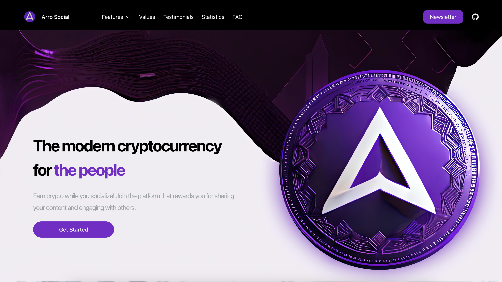

# Arro Social Website
Welcome to the Arro Social Website, a web application designed to showcase the Arro cryptocurrency. This application is built using TypeScript and NextJS, with a newsletter implemented using Mailchimp.

## Features
Arro Social Website has several features that make it a powerful tool for showcasing the Arro cryptocurrency, including:

- Values
- Testimonials
- Statistics
- Frequently Asked Questions
- Newsletter

## Getting Started
To get started with Arro Social Website, follow these steps:

1. Clone the repository to your local machine.
2. Install dependencies by running `yarn`.
3. Set up a Mailchimp account and add your Mailchimp API credentials to the .env.local file.
4. Run the development server by running `yarn dev`.
5. Navigate to http://localhost:3000 to view the application.
6. Add the following environment variables to your .env.local file:
    - `MAILCHIMP_API_KEY`: Your Mailchimp API key.
    - `MAILCHIMP_API_SERVER`: Your Mailchimp API server, such as `us21`
    - `MAILCHIMP_AUDIENCE_ID`: The ID of the Mailchimp audience you want to use for your newsletter.
    - Make sure to include these variables in your .env.local file and add the file to your .gitignore file to keep your keys secure.

## Getting Help
If you have any questions or run into any issues with Arro Social Website, please feel free to reach out to our team by opening an issue on our GitHub repository. We are always happy to help and are committed to providing a positive experience for all users of our application.

